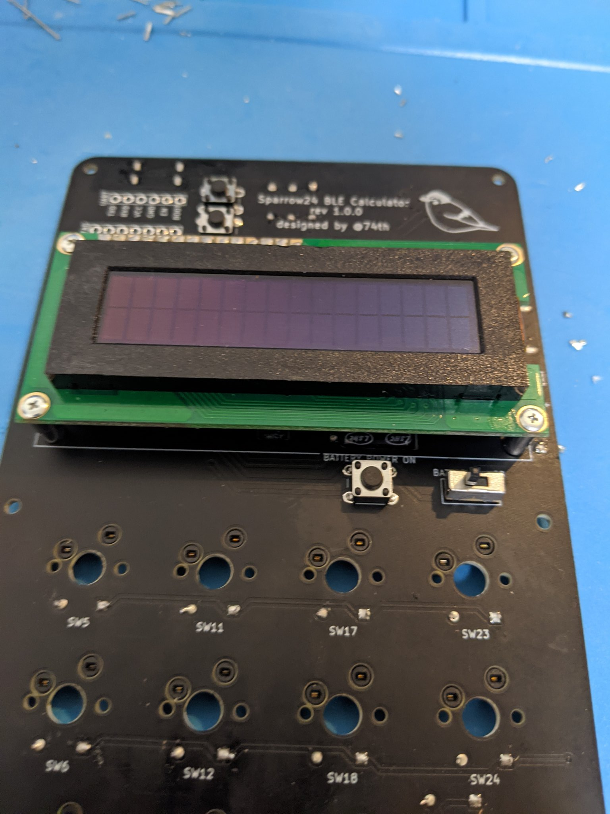

# Sparrow24 BLE Calculator ビルドガイド

『Sparrow24 BLE Calculator 自作キーボードキット』とは、Bluetooth テンキーキーボードと電卓が合体したガジェットが作れるキットです。

## 特徴

- ESP32 マイコンを用いて、Bluetooth キーボードとして動作するテンキーパッド（ESP32 なので技適は問題なし）です。
- モードを切り替えると電卓として動作します。
- 電卓の結果を、Bluetooth キーボードのキーとして送ることができます。
- 乾電池と USB 電源のどちらでも使えます（ただし電池ホルダーは付属しません）。
- ファームウェアを書き込む UART に容易にアクセスでき、ファームウェアを更新することができます。
- ファームウェアはオープンソースとして公開しています。ぜひ機能をリクエストいただいたり、開発に参加ください。 https://github.com/74th/sparrow24-ble-calculator-firmware

## リソース

- 回路図: [https://github.com/74th/sparrow24-ble-calculator-firmware/blob/main/docs/semantics.pdf](https://github.com/74th/sparrow24-ble-calculator-firmware/blob/main/docs/semantics.pdf)
- ビルドガイド: 本リポジトリ
- ファームウェアリポジトリ: [https://github.com/74th/sparrow24-ble-calculator-firmware/](https://github.com/74th/sparrow24-ble-calculator-firmware/)

### 注意

- これは完成品の提供ではなく、ご自身で組み立てが必要なキットです。完成を保証するものではありません。動作しない場合には、質問などは受け付けますが、完成までのサポートを保証するものではありません。御理解の上での購入をお願いします。
- ESP32 の Bluetooth は時折接続不良を起こす場合があります。接続不良だからといっても、交換に応じることはできません。
- これはアマチュア創作作品として作成した自作キーボードキットです。高い完成度を誇るものではありません。
- USB Type-C 端子 は電源専用です。USB キーボードとして動作はしません。
- 電池での電源に対応しますが、電池用の電源を供給する端子を用意するのみで、電池ケースなどは付属していません。
- ファームウェアはオープンソースとして開発中のものです。
- QMK Firmware を利用することはできません。

## BOM 部品表

### キットに含まれるもの

複数の型番のあるものは、どれかが含まれています

- PCB x1
- トッププレート x1
- ボトムプレート x1
- [ESP32-WROOM-32/32D/32E](https://akizukidenshi.com/catalog/g/gM-15675/) x1
- 3.3V 4 端子 レギュレーター [PQ3RD23](https://akizukidenshi.com/catalog/g/gI-01177/)/[NJM2396F33](https://akizukidenshi.com/catalog/g/gI-09261/) x2
- RGBLED [SK6812MINI-E](https://akizukidenshi.com/catalog/g/gI-15478/) x1
- NOR ゲート [TC74HC02AP](https://akizukidenshi.com/catalog/g/gI-11489/) x1
- [スイッチングダイオード 1N4148](https://akizukidenshi.com/catalog/g/gI-00941/) x32
- [ショットキーダイオード SBM1045VSS](https://akizukidenshi.com/catalog/g/gI-06168/) x2
- [電解コンデンサ 22uF](https://akizukidenshi.com/catalog/g/gP-03177/) x2
- [電解コンデンサ 10uF](https://akizukidenshi.com/catalog/g/gP-03116/) x1
- [抵抗 5.1k](https://akizukidenshi.com/catalog/g/gR-16512/) x1
- [抵抗 4.7k](https://akizukidenshi.com/catalog/g/gR-16472/) x2
- [抵抗 10k](https://akizukidenshi.com/catalog/g/gR-16103/) x4
- [4 ピン タクトスイッチ](TS-0606-F-N-BLK) x3
- [スライドスイッチ SS-12D00-G5](https://akizukidenshi.com/catalog/g/gP-08790/) x1
- [電源用 USB Type-C コネクタ UJC-HP-3-SMT-TR](https://akizukidenshi.com/catalog/g/gC-16438/) x3
- [ピンソケット 1x6 UART 用](https://akizukidenshi.com/catalog/g/gC-05779/) x1
- [ピンソケット 1x7 JTAG 用](https://akizukidenshi.com/catalog/g/gC-05779/) x1
- [ピンソケット 1x2 電池電源用](https://akizukidenshi.com/catalog/g/gC-05779/) x1
- [丸ピンソケット 1x14 OLED 用](https://akizukidenshi.com/catalog/g/gP-01591/) x1
- [M2 4mm ネジ](https://www.monotaro.com/p/4926/2744/?displayId=5) x12
- [M2 8mm ネジ](https://www.monotaro.com/p/4926/2586/) x6
- [M2 7mm スペーサー](https://www.monotaro.com/p/1115/0773/) x4
- [M2 3mm スペーサー](https://www.monotaro.com/p/1115/0694/) x6
- [M2 5mm スペーサー](https://www.monotaro.com/p/1115/0737/) x6

### 追加で必要なもの

キースイッチのうち 2U の 3 つは、1U x2 としても使えるようになっております。

- 有機 EL 16 文字 2 行 キャラクターディスプレイモジュール x1
  - 白色 [SO1602AWWB-UC-WB-U](https://akizukidenshi.com/catalog/g/gP-08277/)
  - 緑色 [SO1602AWGB-UC-WB-U](https://akizukidenshi.com/catalog/g/gP-08276/)
  - 黄色 [SO1602AWYB-UC-WB-U](https://akizukidenshi.com/catalog/g/gP-08278/)
  - この秋月で販売されるモジュールには、細ピンヘッダーが付属します [細ピンヘッダー](https://akizukidenshi.com/catalog/g/gC-06631/) x1
- CherryMX 互換キースイッチ x 21 (2U が 3 キーの場合) ~ 24(全て 1U の場合)
  - [遊舎工房](https://shop.yushakobo.jp/collections/all-switches)
  - [TALP Keyboard](https://talpkeyboard.net/?category_id=59cf8860ed05e668db003f5d)
- CherryMX キースイッチ用ソケット x 21(2U が 3 キーの場合) ~ 24(全て 1U の場合)
  - [遊舎工房/スイッチ用 PCB ソケット](https://shop.yushakobo.jp/products/a01ps?_pos=2&_sid=e4f9e0a3a&_ss=r)
  - [TALP Keyboard/CherryMX スイッチ用 Kailh PCB ソケット](https://talpkeyboard.net/items/5e02c5405b120c792616bcf9)
- PCB マウントの 2U スタビライザー x 0(全て 1U の場合) ~ 3(2U が 3 キーの場合)
  - [遊舎工房](https://shop.yushakobo.jp/collections/all-keyboard-parts/Stabilizer)
  - [TALP Keyboard](https://talpkeyboard.net/?category_id=5f884b9b3313d216eb50558a)
  - 誤ってトッププレートマウントのスタビライザーを使用しないように気をつけてください。
- テンキー用キーキャップ及び追加キー用キーキャップ
  - 1U x 20(2U が 3 個の場合) ~ 24(全て 1U の場合)
  - 2U x 0(全て 1U の場合) ~ 3(2U が 3 個の場合)

## 組み立てに必要なもの

### 必ず必要なもの

- はんだごて （ https://www.amazon.co.jp/dp/B001PR1KLK/ など）
- はんだごて台 （ https://www.amazon.co.jp/dp/B0090UJGOW/ など）
- はんだ （ https://www.amazon.co.jp/dp/B0029LGAJI/ や https://www.amazon.co.jp/dp/B0076RPYF6/ など）
- ニッパー （ https://www.amazon.co.jp/dp/B001PR1MRC/ など）
- 精密ドライバー(M2 ネジ用)

### あるとよいもの

- 作業マット （ https://www.amazon.co.jp/gp/product/B088KG28ZC/ など）
- フラックス （ https://www.amazon.co.jp/dp/B002H3NKL4/ など）
- フラックス除去剤 （ https://www.amazon.co.jp/dp/B01GROTPEE/ など）
- ハンダ吸い取り線 （ https://www.amazon.co.jp/dp/B001PR1KPQ/ など）
- ラジオペンチ（スペーサーを固く締めるのに）

## ファームウェアの更新に必要なもの

- PC(Mac/Windows/Linux)
- UART USB シリアル変換
  - [CH340E USB シリアル変換モジュール Type-C AE-CH340E-TYPEC](https://akizukidenshi.com/catalog/g/gK-14745/) など
- ブレットボード用ジャンパ線 （USB シリアル変換と、UART ポートをつなげるもの）
  - https://akizukidenshi.com/catalog/g/gC-05371/
  - https://www.amazon.co.jp/dp/B07LG6R78R/
- USB ケーブル

## 組み立て手順

### RGBLED

SK6812MINI-E は斜めに切れている部分を、PCB の折れ線の入っている方と合わせます。加えて、表裏も気をつけてください。

まず、マスキングテープで留めて、片側をはんだづけします。

もう反対側もはんだ付けします。

### スイッチングダイオード

＜注意＞ダイオードはスイッチングダイオードと、ショットキーダイオードの 2 種類を使い分けます。ショットキーダイオードは OLED の横、スイッチングダイオードはキースイッチ SW の横で使います。

向きに気をつけて差し込みます。PCB の印刷で縦棒の入っている方が、スイッチングダイオードの黒色の方です。

足を広げて、ダイオードを PCB に密着させて、はんだ付けをします。

### ショットキーダイオード

以下の 2 箇所はショットキーダイオードを使います。

向きに気をつけて差し込みます。PCB の印刷で縦棒の入っている方が、ショットキーダイオードの銀色の方です。

足を広げて、ダイオードを PCB に密着させて、はんだ付けをします。

### 抵抗

R1~R7 に正しい大きさの抵抗を差し込みます。

足を広げて、抵抗を PCB に密着させて、はんだ付けをします。

### マイコン ESP32

マイコンをハンダ付けします。

まず、位置合わせをして、アンテナ部をマスキングテーブで留めて、マイコンを固定します。

それぞれの端子をはんだ付けします。横から見て、マイコンの端子と、PCB が接合していることを確認します。

もし、このように隣同士がくっついてしまった場合は、フラックスがあれば追加で塗り、はんだごてをあてて、余分なはんだをはんだごてに移し、はんだごて台のスポンジで取り除きます。ハンダ吸い取り線を使っても良いでしょう。

正しくはんだ付けできているかは、スマートフォンのカメラで拡大して見るとよくわかります。

### 電源用 USB Type-C

USB-C 端子を差し込みます。

動かないように、マスキングテープで留めます。

端子をはんだづけします。

裏側から足をはんだづけします。

3 箇所ありますが、どこからでも電源として使えるようになっています。

電源用 USB Type-C 端子は若干もげやすい部品になっています。[エボキシ樹脂接着剤](https://www.cemedine.co.jp/home/adhesive/epoxy/)などを用いて、端子を補強すると良いです。

### スイッチソケット

スイッチソケットをはんだづけします。

まず、予備はんだとして、PCB のランド（銀色の部分）にハンダを少し乗せます。

ソケットを上から押しながら抑えながら、ソケットの端子にはんだごてをあてて、ソケットの端子にハンダを流し込みます。

ソケットの端子に交互にはんだごてをあて、ソケットを PCB に密着させるようにします。

横から確認し、斜めになっていたり、PCB からソケットが浮いていないかよく確認します。

2U のところは、使うところにソケットをあてます。

### NOR ゲート

NOR ゲートを向きに気をつけて差し込みます。

逆側からはんだづけし、ニッパー足を切ります。

ニッパーで足を切るときには手で抑えて、破片が飛び出さないようにします。

### レギュレータ

レギュレータを、この向きで差し込みます。

レギュレータを PCB に密着するように、足を折り曲げ、マスキングテープで留めます。

反対側からはんだづけをします。

### コンデンサ

コンデンサを向きを注意して差し込みます。長いほうが + 、四角い端子の方になります。

コンデンサを穴に収まるように足を折り曲げます。

足をはんだづけをして、足をニッパで切ります。

### OLED キャラクターディスプレイ

丸ピンソケットを、こちらの向きで差し込みます。

OLED キャラクターディスプレイ付属の細ピンヘッダーを差し込み、さらに上から OLED キャラクターディスプレイを差し込みます。PCB と 8mm スペーサーも、4mm ネジで留めます。OLED キャラクターディスプレイと、PCB の両方をはんだづけします。

### スタビライザー

スタビライザーを取り付けます。向きはこの向きです。PCB に密着するように取り付けます。さしこむのみで、はんだ付けはありません。

### ソケット

まず、PCB とトッププレートの間を、4mm ネジと 3mm のスペーサーを用いて留めます。上 4 つのみで構いません。

UART、JTAG のそれぞれの箇所にピンソケットを差し込み、マスキングテープで留めます。

裏からはんだづけをします

はんだづけをしたあとは、一度ネジを取り外します。

### トッププレート、ボトムプレート

トッププレートから 8mm ネジを差し込み、さらに 3mm スペーサーを回し入れます。

その上に PCB を差し込みます。

その上から 5mm スペーサーを回し入れます。

ボトムプレートを差し込み、4mm ネジで留めます。

あとは、キースイッチとキーキャップをつければ組立完成です。

## ファームウェアのアップロード方法

キットに含まれている ESP32 には、梱包時点のファームウェアがインストールされています。

ファームウェアのアップロードには、以下の機材が必要です。

- UART USB シリアル変換
  - [CH340E USB シリアル変換モジュール Type-C AE-CH340E-TYPEC](https://akizukidenshi.com/catalog/g/gK-14745/) 
  - [KKHMF CH340モジュール STC マイクロ コントローラー ダウンロード USBターンTTLシリアル](https://www.amazon.co.jp/dp/B014VVPZT4/) ([Windows用ドライバ](http://www.wch-ic.com/downloads/CH341SER_EXE.html))
  - など
- ブレットボード用ジャンパ線 （USB シリアル変換と、UART ポートをつなげるもの）
  - https://akizukidenshi.com/catalog/g/gC-05371/
  - https://www.amazon.co.jp/dp/B07LG6R78R/
- USB ケーブル

以下のリポジトリでファームウェアのコードは公開しています。

https://github.com/74th/sparrow24-ble-calculator-firmware

USB シリアル変換モジュールと、UART ポートをジャンパ線でつなぎます。AE-CH340E-TYPEC であれば、以下のようにつなぎます。

| AE-CH340E-TYPEC | Sparrow24 UART ポート |
| --------------- | --------------------- |
| VCC             | VCC                   |
| GND             | GND                   |
| RXD             | TXD                   |
| TXD             | RXD                   |

他のポートは接続しなくて構いません。（BOOT、EN ポートは BOOT、EN ボタンの代わりに操作することができます。）

[Visual Studio Code](https://code.visualstudio.com/)をインストールします。

Git Clone したリポジトリを VS Code で開くか、F1 キー->コマンド"Git: Clone (Recursive)"を選択し、"https://github.com/74th/sparrow24-ble-calculator-firmware"を入力します。すると、VS Code でソースコードがチェックアウトされます。

[拡張機能『Platform IO』](https://marketplace.visualstudio.com/items?itemName=platformio.platformio-ide)をインストールします。インストールするには、左端のアクティビティーバーから拡張機能タブをクリックし、テキストボックスに"platformio"と入力し、表示された PlatformIO IDE の項目のインストールボタンを押します。

ステータスバーのアップロードボタンを押します。

「Connecting...」と表示されたら、BOOT ボタンを押しながら EN を押し、EN、BOOT の順でボタンを離します。

書き込みが 100%まで進み、その後 EN を押します。
